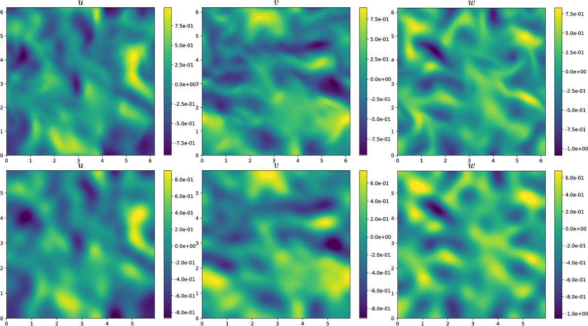
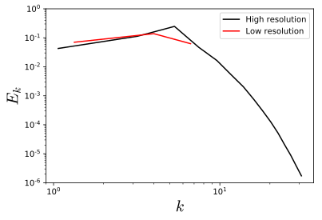

## Turbulence Enrichment using Generative Adversarial Networks
Project category: GANs

| **Team members**     | **SUID**   |
|:---------------------|:----------:|
| Raunak Borker        | rborker    |
| Sravya Nimmagadda    | sravya     |
| Akshay Subramaniam   | akshays    |
| Man-Long Wong        | wongml     |

### What and why
Turbulent flow is important in many engineering applications. However, simulating turbulence is very computationally expensive due to extremely high resolution requirements. Large Eddy Simulations (LES) that simulate only the large scales have become popular due much lower cost, but require explicit modeling of the small scales. Here, we propose to enrich LES data by populating it with small scales obtained using a Generative Adversarial Network (GAN).

Modeling turbulence accurately is extremely challenging especially in capturing high order statistics due to its intermittent nature. GANs have been shown to perform better than other data driven approaches like PCA in capturing high order moments [[1]](https://arxiv.org/pdf/1708.01810.pdf). In addition, generating physically realistic realizations are important for physical simulation data; a constraint not present when using generative models for images. Incorporating this constraint into the GAN framework would be crucial to its performance.

### Data
We will generate our own data set using an in-house simulation code (PadeOps). This will require running the code on a compute cluster using 256 processors for multiple days. We have access to compute clusters that would allow us to generate the required data.

Comparison of the high-resolution (top) and low resolution (bottom) data:

Comparison of the power spectral density of the high-resolution and low-resolution data:

### Methodology
We will use GANs[[2]](https://arxiv.org/pdf/1406.2661.pdf) in a fashion similar to super-resolution applications for image data [[3]](https://arxiv.org/pdf/1609.04802.pdf). We will also include the physics realizability constraint through a term in the loss function similar to the physics informed deep learning method in [[4]](https://arxiv.org/pdf/1711.10561.pdf).

ResNet for Turbulence Enrichment:

### References
[1] Chan, Shing, and Ahmed H. Elsheikh. "Parametrization and Generation of Geological Models with Generative Adversarial Networks." arXiv preprint arXiv:1708.01810 (2017).

[2] Goodfellow, Ian, et al. "Generative adversarial nets." Advances in neural information processing systems. 2014.

[3] Ledig, Christian, et al. "Photo-realistic single image super-resolution using a generative adversarial network." arXiv preprint (2016).

[4] Raissi, Maziar, Paris Perdikaris, and George Em Karniadakis. "Physics Informed Deep Learning (Part I): Data-driven Solutions of Nonlinear Partial Differential Equations." arXiv preprint arXiv:1711.10561 (2017).

### Evaluation
To evaluate our results quantitatively, we will quantify energy spectra, statistical moments and physical realizability errors. We will also plot the generated flow data and compare qualitatively to the high-resolution ground truth.
